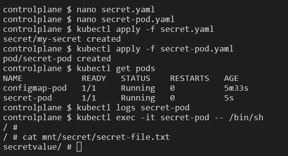
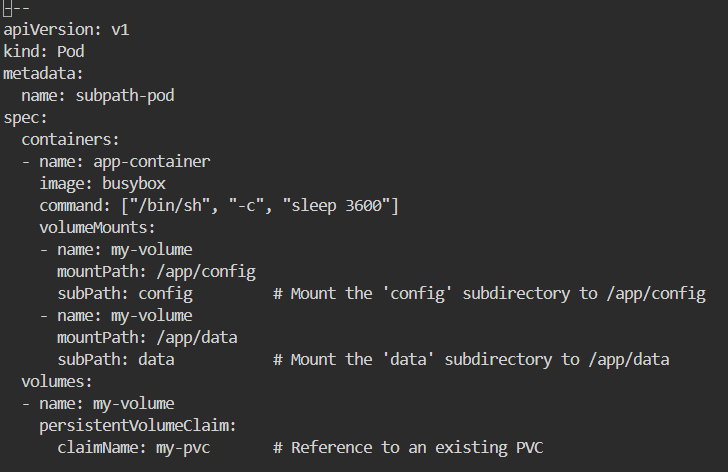

# k8s-lab6

1- What is a volume in Kubernetes, and how does it differ from a container's storage?

    In Kubernetes, a Volume is a storage resource that a Pod can use to persist data. It provides a way for data to survive beyond the life of a container, allowing the data to persist across container restarts or even Pod terminations. Kubernetes Volumes can be backed by a variety of storage types, including local storage, network storage, or cloud-based storage systems.

    Key Differences Between a Volume and a Container’s Storage:

        Lifecycle:

            Volume: The lifecycle of a Volume is tied to the Pod, not the container. This means the Volume persists as long as the Pod exists, even if individual containers within the Pod restart or fail.
            Container’s Storage: The storage in a container (also known as ephemeral storage) only lasts for the lifetime of the container. When the container is terminated or restarted, all data stored inside the container is lost.

        Persistence:

            Volume: A Volume provides persistent storage, allowing data to be retained even if containers are restarted. This can be useful for storing application data, logs, or configuration files that need to be retained across container restarts.
            Container’s Storage: Container storage is temporary. Any data written inside the container's file system is lost when the container stops or is destroyed.

        Sharing:

            Volume: Volumes can be shared between multiple containers in the same Pod. For example, two containers can both read and write to the same Volume, making it useful for collaborative processes within a Pod.
            Container’s Storage: Each container has its own isolated storage, and by default, containers cannot share storage with each other.

        Storage Types:

            Volume: Kubernetes supports different types of volumes, such as emptyDir, hostPath, persistentVolumeClaim, and cloud storage volumes (like awsElasticBlockStore, gcePersistentDisk).
            Container’s Storage: Container storage is part of the container image and typically includes only temporary storage for caching or logs.

2- What are the different types of volumes available in Kubernetes? Describe at least three types and their use cases.

    Kubernetes supports various types of volumes to handle different use cases for data persistence and storage needs. Here are three common types of volumes in Kubernetes and their use cases:

    1. emptyDir : emptyDir is a temporary volume that is created when a Pod is assigned to a node. It is initially empty and can be used by all containers in the Pod.
    Use Case: It is typically used for scratch space, temporary data storage, or caching between containers. For example, if multiple containers in a Pod need to process data temporarily, they can share data via an emptyDir volume.
    Persistence: The data in an emptyDir is deleted when the Pod is removed or if the Pod is restarted.
    Example Use Case: You could use emptyDir for temporary files that don’t need to persist beyond the lifetime of a Pod, such as caches for web servers or intermediary results for data processing.

    2. hostPath : hostPath mounts a file or directory from the host node’s filesystem into the Pod. This is useful when the application running in the Pod needs direct access to the underlying host system's storage.
    Use Case: hostPath can be used for logging, where a container writes logs to a file on the host, or for sharing configuration files or tools that reside on the host. It is also useful for applications that require access to specific hardware like GPU drivers.
    Persistence: The data in a hostPath volume persists as long as the node exists, but it is tied to the specific node. If the Pod moves to another node, the data won’t be available.
    Example Use Case: A logging service that writes logs directly to a file on the host machine for local analysis or debugging purposes.

    3. persistentVolumeClaim (PVC): A persistentVolumeClaim is a request for persistent storage by a Pod. It allows users to dynamically provision storage and attach it to Pods. This is typically backed by network storage, such as NFS or cloud storage solutions like AWS EBS, GCE Persistent Disk, etc.
    Use Case: PVCs are used for long-term, durable storage that needs to persist beyond the Pod's lifecycle. This is ideal for databases, stateful applications, or any other use case where the data needs to be saved even if the Pod is deleted or recreated.
    Persistence: The data persists independently of the Pod. If a Pod is deleted or rescheduled, the data in the persistent volume remains and can be re-attached to another Pod.
    Example Use Case: Using a PVC to store data in a MySQL or PostgreSQL database, ensuring that the database state is preserved across Pod restarts and redeployments.

3- How do PersistentVolumes (PVs) and PersistentVolumeClaims (PVCs) work together in Kubernetes? Explain their relationship and purpose.

    In Kubernetes, PersistentVolumes (PVs) and PersistentVolumeClaims (PVCs) are used together to provide persistent storage for applications running in a cluster. They decouple storage management from application deployment, allowing storage to be managed independently of Pods.

    1. PersistentVolume (PV) is a piece of storage in the cluster that has been provisioned by an administrator (or dynamically provisioned by Kubernetes using storage classes). It represents a physical storage resource, like a disk on a cloud provider, network storage, or local disk on a node.

    Purpose: A PV provides actual storage in the cluster that can be used by applications.

    Lifecycle: A PV exists independently of any Pod, meaning it is not tied to the Pod's lifecycle. It can persist data even after a Pod using it has been deleted or restarted.

    2. PersistentVolumeClaim (PVC) is a request for storage made by a Pod. The claim specifies how much storage is needed, the access mode, and optionally, other storage requirements.

    Purpose: A PVC is used by Pods to request storage resources. It allows Pods to use a PV without needing to know the details of the underlying storage.

    Lifecycle: A PVC is created by a user or application, and it binds to a PV that meets its storage requirements.

    3. How PV and PVC Work Together
    Binding Process: When a PVC is created, Kubernetes looks for a PV that satisfies the storage request in the PVC. Once a suitable PV is found, it is bound to the PVC. The relationship between a PVC and PV is typically one-to-one, meaning a PVC can only be bound to one PV, and vice versa.

    Dynamic Provisioning: If no existing PV meets the criteria of the PVC, and if dynamic provisioning is enabled (through storage classes), Kubernetes will automatically create a PV to satisfy the PVC request. This is particularly useful in cloud environments where storage can be provisioned on demand.

    Access by Pods: Once a PVC is bound to a PV, the PVC can be used by a Pod as a volume. The Pod declares a volume in its configuration using the PVC name, and Kubernetes ensures that the Pod is connected to the storage resource.

    4. Relationship Between PV and PVC
    PersistentVolume (PV): The actual physical or cloud-based storage resource.
    PersistentVolumeClaim (PVC): A claim/request for that storage by an application or user.
    Binding: The process that connects a PVC to a PV, making the storage available to Pods.

    5. Purpose and Benefits of PV/PVC
    Separation of Concerns: PVs abstract the details of the underlying storage (local disk, cloud disk, network storage), allowing developers to request storage using PVCs without needing to worry about the specifics of provisioning storage.
    Reusability and Flexibility: Storage administrators can pre-provision PVs, and different Pods can claim and use them through PVCs. The PVC/PV pattern also supports dynamic provisioning where storage is created on-demand.
    Persistence: The PV/PVC model ensures that data can outlive individual Pod lifecycles, making it suitable for databases, logging systems, and other stateful applications.

4- Create a Pod with an emptyDir volume:

    

    

5- Set up a Pod with a hostPath volume:

    

6- Deploy a PersistentVolume (PV) and PersistentVolumeClaim (PVC):

    

    

    

7- Create a Pod that uses a PVC:

    

    

8- Dynamic Provisioning of Persistent Volumes:

    

    

    

9- Use a configMap as a Volume:

    

    

    

10- Create a Pod with a secret as a Volume:

    

    

    

11- Set up a Pod with a gitRepo volume:

    

    

12- Resize a Persistent Volume Claim (PVC):

    

    

    

    

    

    

13- Use subPath for mounting volumes:

    

    

    